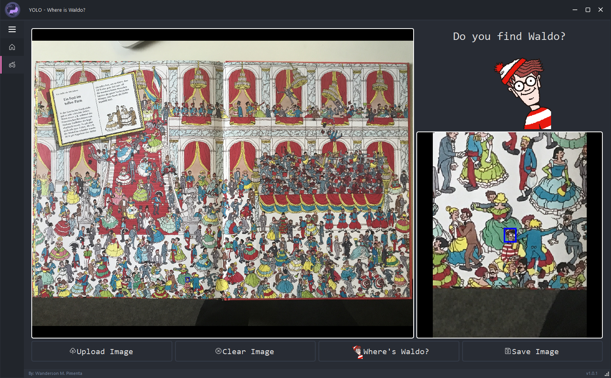

# Where's Waldo?

## Overview
This project utilizes the YoLoV8 model to train on images from the classic children's book "Where's Waldo?". The goal is to enable the model to identify and mark the location of Waldo within the images.


## Features
- **Model Training**: Trained using images from "Where's Waldo?" to enhance the model's ability to detect Waldo in various scenarios. The training process includes data augmentation techniques to improve model robustness.
- **Object Detection**: Utilizes the YoLoV8 model for accurate detection, ensuring high performance in identifying Waldo. The model achieves high precision and recall rates, making it effective in diverse image conditions.
- **User Interface**: Front-end interface built with PySide6 for user interaction, allowing users to upload images and view results seamlessly.
- **Data Augmentation**: Implements techniques such as random erasing and brightness/contrast adjustments to enhance the training dataset.
- **Visualization**: Provides functionality to visualize bounding boxes on images based on YOLO predictions, aiding in the evaluation of model performance.

## Installation
1. Clone the repository:
   ```bash
   git clone https://github.com/adsl135789/Where_is_waldo.git
   ```
2. Navigate to the project directory:
   ```bash
   cd Where_is_waldo
   ```
3. Install the required dependencies:
   ```bash
   pip install -r requirements.txt
   ```

## Frontend
The user interface (UI) is built using PySide6 and Qt Designer, providing an intuitive experience for users to interact with the application. Key features of the UI include:
- **Image Upload**: Users can upload images to be processed for Waldo detection.
- **Detection Results**: The application displays results with bounding boxes around detected instances of Waldo.
- **Customizable Interface**: The UI supports a custom theme and layout, enhancing user experience.
- **Responsive Design**: The application adjusts to different screen sizes and resolutions, ensuring usability across devices.

## Contributing
Contributions are welcome! Please open an issue or submit a pull request. Ensure to follow the project's coding standards and guidelines.


## Acknowledgments
- Special thanks to the creators of the YoLoV8 model for their contributions to the field of object detection.
- Thanks to the authors of "Where's Waldo?" for providing the inspiration and dataset for this project.
